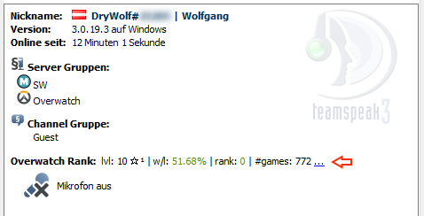
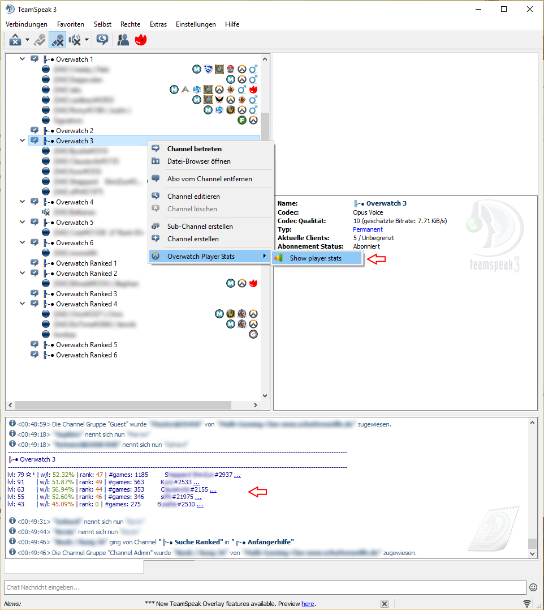

# ts3-overwatch-stats-plugin
This TeamSpeak 3 plugin allows to view Overwatch player statistics.

### Disclaimer

This plugin is in the early alpha preview phase. Bugs are expected to happen, please report them in the [issue list](https://github.com/drywolf/ts3-overwatch-stats-plugin/issues).

### Download

- TBD

### Features

----------

- Show individual player statistics by selecting a TS3 client in the channel selection
	- (requires valid BattleTag in TS3 client name)
	- shows XP player-level & prestige-level stars
	- shows win/loss ratio in percent
	- shows competitive rank (0 if not qualified)
	- shows number of total played games (quick-play and competitive)
	- shows link to [masteroverwatch.com](http://masteroverwatch.com/) player profile

----------

- Show player statistics for all TS3 clients in a selected channel by using the right-click context menu option
	- (requires valid BattleTags in TS3 client names)
	- shows XP player-levels & prestige-level stars
	- shows win/loss ratios in percent
	- shows competitive ranks (0 if not qualified)
	- shows number of total played games (quick-play and competitive)
	- shows links to [masteroverwatch.com](http://masteroverwatch.com/) player profiles

----------

### License

- Licensed under the MIT license
- see [LICENSE](https://github.com/drywolf/ts3-overwatch-stats-plugin/blob/master/LICENSE) for details

### Credit

- This plugin uses:
	- [OWAPI](https://github.com/SunDwarf/OWAPI) to get the Overwatch player statistics
	- [libcurl](https://github.com/curl/curl) to download JSON data from the OWAPI
